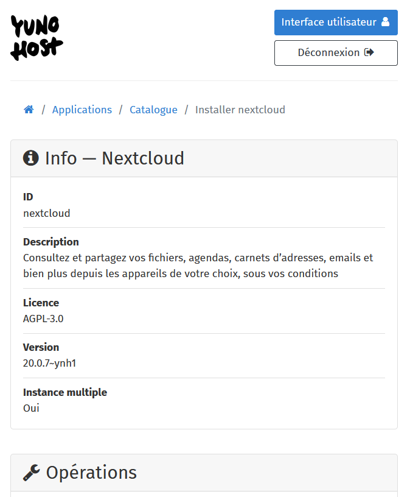
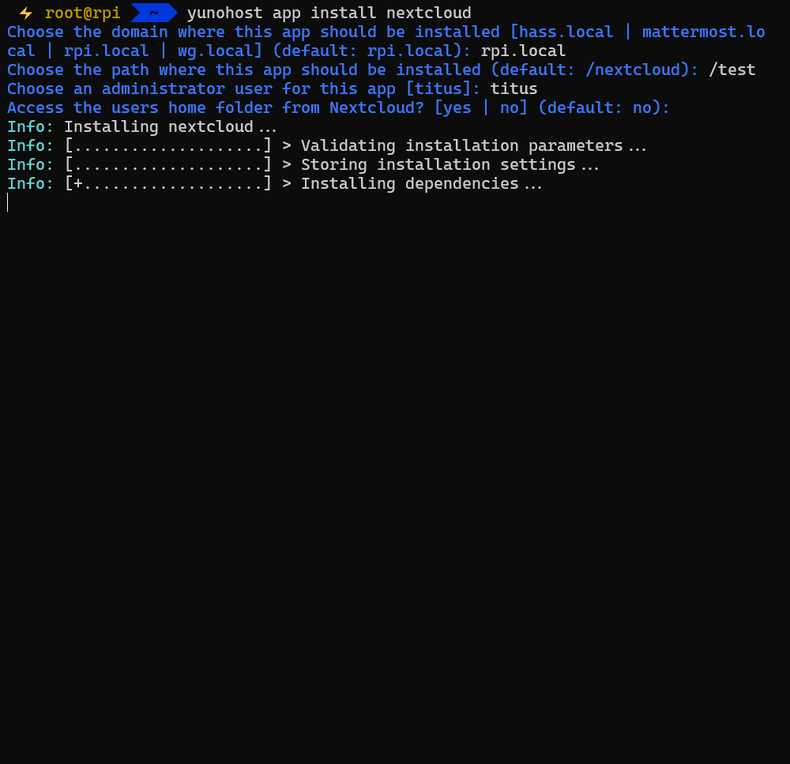
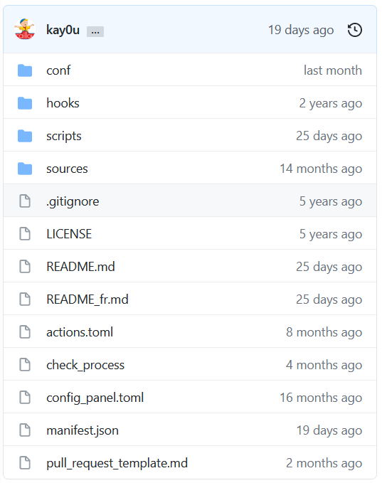
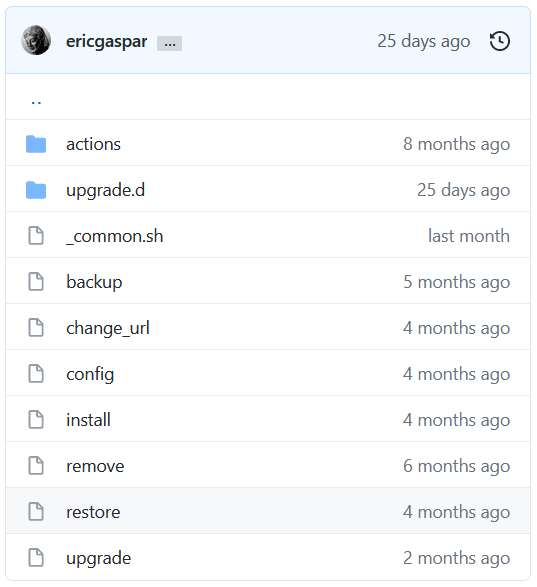
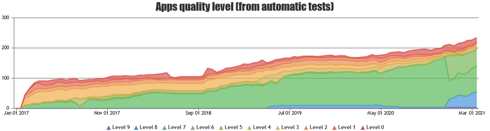
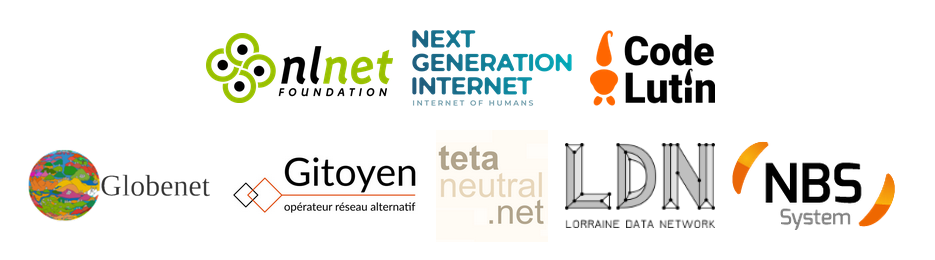

## De l'auto-hébergement  à l'élevage de CHATONS

### Journées du Logiciel Libre
### 2021-04-04 - 11:00 CET

----

 

`tituspijean`

---

## Sommaire

1. Pourquoi s'auto-héberger ?
2. YunoHost
3. Côté administrateur ($\hookleftarrow$ c'est vous !)
4. Côté technique
5. Côté communauté

---

## Introduction

----

### Qui possède vos données ?

* Votre disque dur, clé USB, ...
* Fournisseurs de services (*drive, *box)

----

<!-- .slide: data-background-image="./uploads/upload_e991f29ebf5cae9b1f6f7fa4ed6db8c7.jpg" data-background-size="contain" data-background-color="black" -->

 
 
 
 
 
 
 
 
 
 
 

### Envoi centralisé de données vers le nuage
<!-- .element style="color: white;" -->
*Incendie d'un centre de données d'OVH,
à Strasbourg, mars 2021*
<!-- .element style="color: white;" -->

----

<small>Illustration par JimboJoe</small>

----

### Vie privée

Est-il bien raisonnable que notre garagiste connaisse...
- avec qui on covoiture ;
- ce que l'on écoute à la radio ;
- nos trajets quotidiens et exceptionnels ;
- et moultes autres choses bien personnelles...

sous prétexe que c'est pour rendre un service "plus personnalisé",
et en profiter pour revendre notre "profil" aux constructeurs automobiles ou autres vendeurs de sapins sent-bon ?
<!-- .element class="fragment" -->

*Ici, le garagiste, c'est n'importe quel GAFAM.*
<!-- .element class="fragment" -->

----

Qu'ont en commun

*L'origine du monde* de Courbet,
<!-- .element class="fragment" -->

des oignons,
<!-- .element class="fragment" -->

et D. Trump ?
<!-- .element class="fragment" -->

### La liberté d'expression <!-- .element class="fragment" -->

----

* Possession des données
* Décentralisation
* Vie privée
* Liberté d'expression

## $\implies$ Motivations à l'auto-hébergement

----

## Comment s'auto-héberger ?
### Le matériel

   

----

## Comment s'auto-héberger ?
### Le logiciel

|             | Alternatives libres |
| ----------- | -------- |
| Twitter |  Mastodon |
| Dropbox, GDrive... |  Nextcloud |
| Office Online |  Cryptpad |
| Tout système de domotique |  Home Assistant |
| Messenger, Whatsapp, Wechat... |  |
<!-- .element style="width: 90%" -->

**... chacun avec ses propres prérequis
et instructions d'installation**

---

<!-- .slide: data-background-image="https://64.media.tumblr.com/4b3b0287ca43ce1021340cd692f65f9f/tumblr_mj7iufgKNi1qghl49o1_500.gifv" -->

----

## Il est *nécessaire* de rendre l'administration de serveurs __simple__

----

 vs.?  

> CHATONS est le **Collectif des Hébergeurs Alternatifs, Transparents, Ouverts, Neutres et Solidaires**. Ce collectif vise à rassembler des structures proposant des services en ligne libres, éthiques et décentralisés.
https://chatons.org
https://wiki.chatons.org/doku.php/yunohost
<!-- .element style="width: 90%" -->

----

# , c'est quoi ?
-  une distribution Debian
<!-- .element class="fragment" style="width: 100%" -->
-  une interface d'administration simple
<!-- .element class="fragment" style="width: 100%" -->
-  des services fonctionnels dès l'installation
<!-- .element class="fragment" style="width: 100%" -->
-  des noms de domaines gratuits et automatiquement configurés (`.ynh.fr`, `.nohost.me`, `.noho.st`)
<!-- .element class="fragment" style="width: 100%" -->
-  plus de 200 applications installables en quelques clics 
<!-- .element class="fragment" style="width: 100%" -->
-  un portail de connexion pour les personnes inscrites
<!-- .element class="fragment" style="width: 100%" -->
-  un système de permissions pour contrôler les accès aux apps
<!-- .element class="fragment" style="width: 100%" -->
-  un système de diagnostic pour déboger tout ça
<!-- .element class="fragment" style="width: 100%" -->

----

## YunoHost, côté utilisateur/administrateur
### Une petite démo ?

https://demo.yunohost.org

---

## YunoHost, côté technique

----

### Installable en moins d'une heure

   

----

### Automatisation des tâches de sysadmin

Accessibles via l'interface web ou la ligne de commande

  

----

### Les applications

Des fichiers de description, de configuration,
et des scripts Bash pour laisser la magie opérer.

\+ un système de tests automatisés pour aider les *packagers*

----

### Feuille de route

- 4.2 (en test)
    - Passage de Python 2 à Python 3
    - Réécriture de la webadmin
    - Import d'utilisateurs ( )
    - Simplification de la post-installation
- 4.3
    - Formulaire d'inscription des utilisateurs ( )
    - Une configuration améliorée des apps, après leur installation
- et encore...
    - Fédération de serveurs

---

## YunoHost, côté communauté

----

### ~5000 instances YunoHost

----

### Plus de 200 applications

208 pleinement fonctionnelles sur 236 testées
383 en tout dans les tuyaux

----

### Nous trouver

* Le site web de YunoHost : https://yunohost.org
* Le forum pour les annonces et l'entraide : https://forum.yunohost.org
* Des salons de discussion d'entraide pour le support, le *packaging* d'apps, le développement : [Matrix/IRC](https://yunohost.org/fr/chat_rooms)
* La documentation : https://yunohost.org/docs

 bénévoles
 contributeurs (Python, UX, HTML, CSS, JS, Bash, ...)

----

#  Nos soutiens

----

## Dans les coulisses...

* Présentation diffusée avec [Galène](https://galene.org)...
* ... faite avec [Reveal.js](https://revealjs.com/) sur [HedgeDoc](https://hedgedoc.org/)...
* ... que j'accède avec mon propre VPN avec [WireGuard](https://wireguard.com)...
* ... le tout auto-hébergé sur mon serveur 

---

# Avez-vous des questions ?